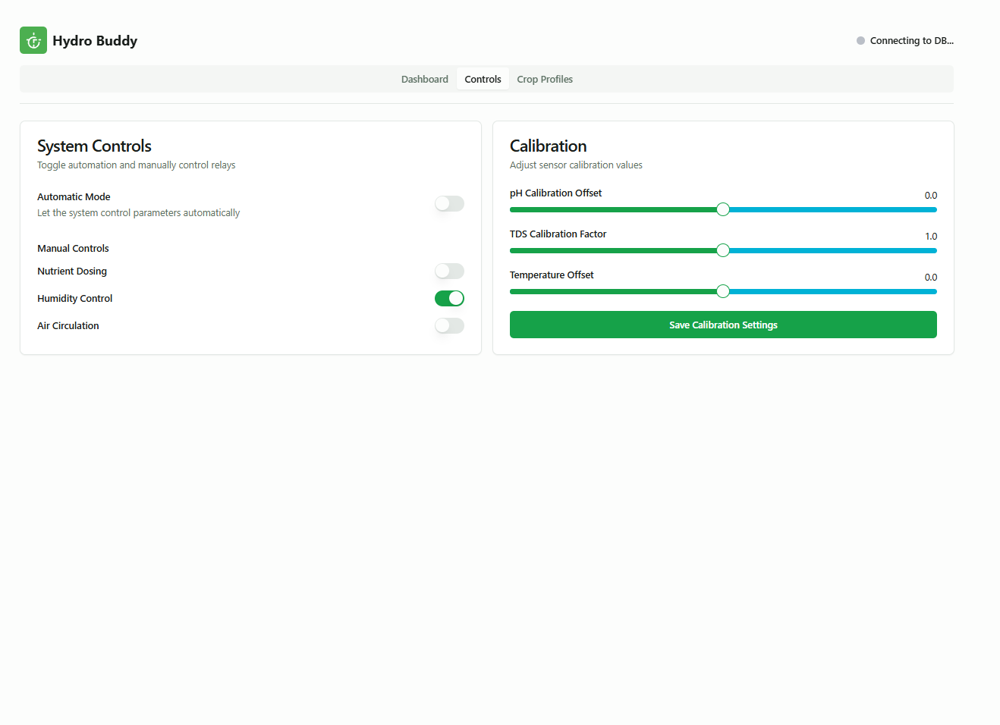

# HydroBuddy Grow System


*Dashboard view showing real-time sensor readings, historical data chart, and system status with relay indicators.*

HydroBuddy is a smart hydroponics monitoring and control system that helps you grow plants efficiently using IoT technology. It combines hardware sensors with a web-based dashboard to automate and monitor your hydroponic setup.

## What It Does

HydroBuddy continuously monitors key parameters for hydroponics:
- Water and air temperature
- Water pH level
- TDS (Total Dissolved Solids) for nutrient concentration
- Air humidity

The system provides:
- Real-time sensor readings
- Automated control based on crop profiles
- Historical data visualization
- Remote monitoring via web dashboard


*Control panel interface with manual relay controls, auto mode toggle, and sensor calibration settings.*

## Hardware Components

### Sensors
- DS18B20 waterproof temperature sensor (water temperature)
- DHT11 sensor (air temperature and humidity)
- Analog pH sensor with BNC connector
- TDS (EC) sensor for nutrient concentration

### Control Hardware
- ESP32 microcontroller (main board)
- BC547 transistors for relay control
- 5V relay modules for controlling pumps/fans
- Power supply (5V/2A recommended)

### Optional Components
- Peristaltic pumps for nutrient dosing
- Cooling fans for temperature control
- Humidifier for humidity control

### 3D Printed Components
The system includes 3D printable enclosures found in the STL Files directory:
- `hydroponics_box.stl` - Main enclosure for electronics
- `hydroponics_lid.stl` - Protective lid for the enclosure

### Hardware Connections

#### ESP32 Pin Connections
| Component | ESP32 Pin | Notes |
|-----------|-----------|-------|
| DS18B20 Temperature Sensor | GPIO 4 | Use a 4.7kΩ pull-up resistor between data and VCC |
| DHT11 Temp/Humidity Sensor | GPIO 2 | Use a 10kΩ pull-up resistor between data and VCC |
| pH Sensor (Analog) | GPIO 34 | Analog input only, no pull-up needed |
| TDS Sensor (Analog) | GPIO 35 | Analog input only, no pull-up needed |
| Relay 1 (Nutrient Pump) | GPIO 25 | Via BC547 transistor with 1kΩ base resistor |
| Relay 2 (pH Control) | GPIO 26 | Via BC547 transistor with 1kΩ base resistor |
| Relay 3 (Water Pump) | GPIO 27 | Via BC547 transistor with 1kΩ base resistor |
| Relay 4 (Fan/Cooling) | GPIO 14 | Via BC547 transistor with 1kΩ base resistor |

#### Power Connections
- ESP32: 5V from power supply or USB
- Sensors: 3.3V from ESP32 or regulated 3.3V supply
- Relays: 5V from external power supply (separate from ESP32 logic power)

#### Transistor Wiring (for each relay)
```
ESP32 GPIO Pin ---> 1kΩ Resistor ---> BC547 Base
                                       BC547 Emitter ---> GND
                                       BC547 Collector ---> Relay Control Pin
```

#### Sensor Wiring
- **DS18B20 Temperature Sensor**:
  - Red wire to 3.3V
  - Black wire to GND
  - Yellow/Data wire to GPIO 4 with 4.7kΩ pull-up resistor

- **DHT11 Temperature/Humidity Sensor**:
  - VCC to 3.3V
  - GND to GND
  - DATA to GPIO 2 with 10kΩ pull-up resistor

- **pH Sensor**:
  - BNC connector to pH probe
  - VCC to 5V
  - GND to GND
  - Analog Output to GPIO 34

- **TDS Sensor**:
  - VCC to 5V
  - GND to GND
  - Analog Output to GPIO 35

### Wiring Diagram Notes
- Keep sensor cables away from power lines to reduce interference
- Use shielded cables for pH and TDS sensors to improve accuracy
- Add 100μF capacitor between relay power supply and GND to reduce interference
- Connect all GND points to a common ground


*Crop profiles management interface showing parameter ranges for different crops and profile activation controls.*

## Software Components

### Microcontroller Code
- Arduino code for ESP32 (`hydroponics_final.ino`)
- Sensor data collection and processing
- WiFi connectivity and HTTP server
- Automatic control logic based on crop parameters

### Web Dashboard
- React TypeScript frontend
- Realtime sensor data visualization with interactive charts
- Crop profile management
- Responsive design for desktop/mobile access

### Backend
- Supabase for data storage and authentication
- RESTful API endpoints for sensor data
- Serverless functions for relay control and data processing
- Historical data retrieval and analysis

## Setting Up the Project

### Hardware Setup
1. Connect sensors to the ESP32 according to the pin definitions in `hydroponics_final/hydroponics_final.ino`
2. Connect the relay modules to the transistor control pins
3. Power the ESP32 and sensors with a 5V power supply
4. Optional: 3D print the enclosure using the STL files provided

### Software Setup
1. Clone the repository:
   ```
   git clone https://github.com/charan-271/hydro-buddy-grow-system.git
   cd hydro-buddy-grow-system
   ```

2. Install dependencies:
   ```
   bun install
   ```

3. Configure the ESP32:
   - Open `hydroponics_final/hydroponics_final.ino` in Arduino IDE
   - Set your WiFi credentials
   - Set the correct API endpoint for your Supabase instance
   - Upload to your ESP32

4. Configure the web dashboard:
   - Create a `.env` file with your Supabase credentials
   - Start the development server:
     ```
     bun run dev
     ```

5. Deploy Supabase functions:
   ```
   cd supabase
   supabase functions deploy
   ```

## Project Structure
The project follows a clean and modular structure:
- `/src/components` - React components for the dashboard
- `/src/hooks` - Custom React hooks for data and WebSocket handling
- `/src/integrations/supabase` - Supabase client configuration
- `/supabase/functions` - Serverless functions for relay and sensor data
- `/hydroponics_final` - Arduino code for the ESP32
- `/STL Files` - 3D printable enclosure designs

## Main Features

- **Real-time Monitoring**: View sensor data as it's collected
- **Historical Data**: Track plant growth conditions over time
- **Crop Profiles**: Preset configurations for different plant types
- **Automated Control**: Set-and-forget system that adjusts to optimal conditions
- **Mobile Responsive**: Monitor your system from anywhere

## Technologies Used

- **Frontend**: React, TypeScript, TailwindCSS, Shadcn UI
- **Backend**: Supabase (PostgreSQL database)
- **Hardware**: ESP32, Arduino libraries
- **Communication**: HTTP for API requests, WebSockets for realtime updates
- **Build Tools**: Vite, Bun

## Contributing

Contributions are welcome! Please feel free to submit a Pull Request.

## License

This project is open-source, available under the MIT License.